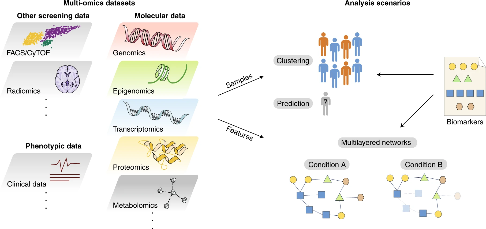

Our research spans three interconnected areas:

- **Multi-omics data integration**: We develop statistical frameworks and tools to jointly analyze data from heterogeneous omics sources. Some examples of these [tools](tools/index.qmd) are: 
    - [MORE](https://github.com/BiostatOmics/MORE/), for the inference of multi-layer regulatory networks and compare them across different phenotypes; 
    - [MOSim](https://bioconductor.org/packages/MOSim/), for simulating multi-omic bulk and single-cell data, which is useful  to prepare and test pipelines and tools; 
    - [Coxmos](https://cran.r-project.org/package=Coxmos), for the discovery of molecular signatures associated with survival.

[{.research-line-img}](https://doi.org/10.1038/s43588-021-00086-z)

- **Single-cell and spatial technologies**: We build computational methods tailored to the unique 
challenges of single-cell RNA-seq, long-read sequencing, and spatial transcriptomics data. We are currently adapting our tools to deal with the specific features of these new technologies.

- **Clinical and translational applications**: We apply our methods to real biomedical problems, 
including cancer (ovarian, lung), neurodegenerative diseases (Parkinson's), metabolic disorders 
(diabetes, hepatic encephalopathy), etc.